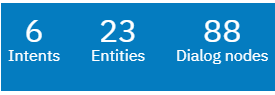
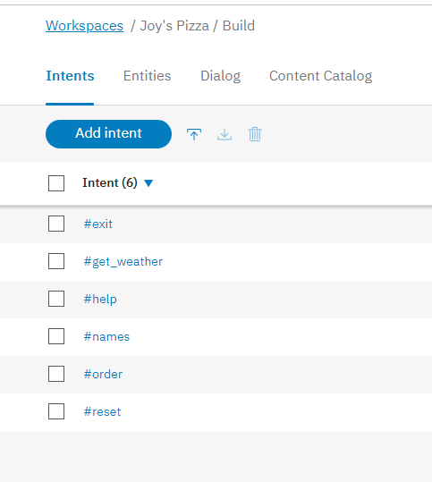
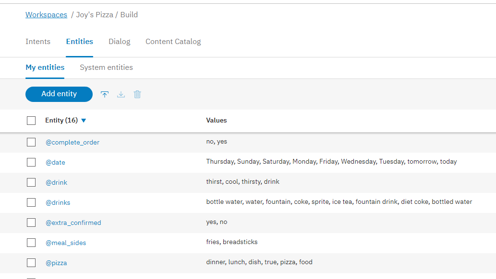
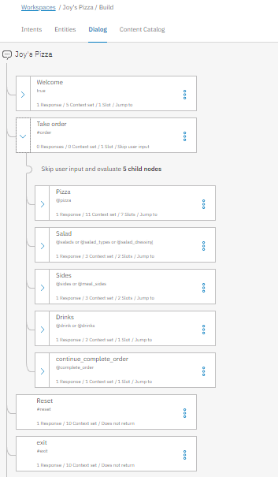
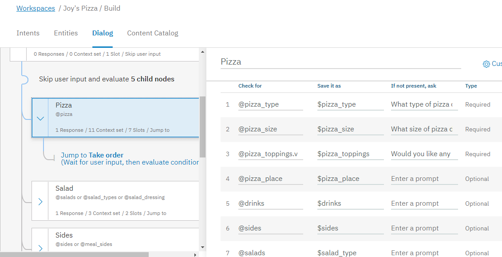
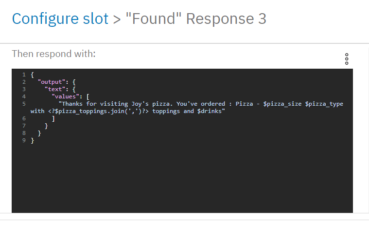
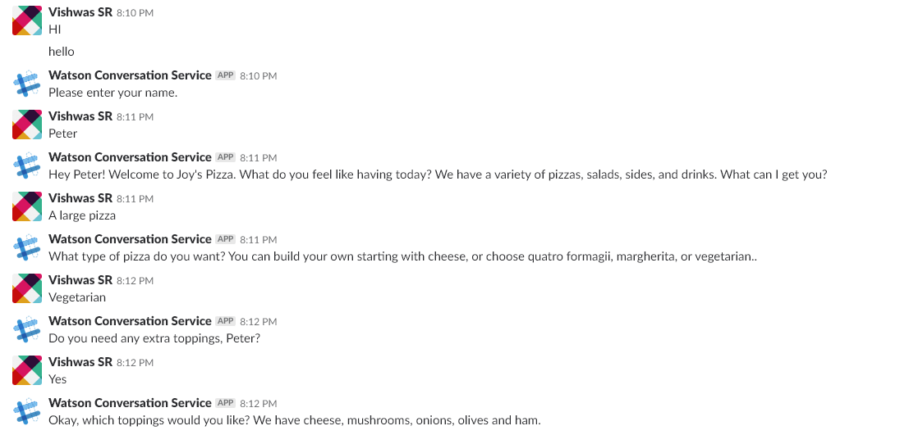
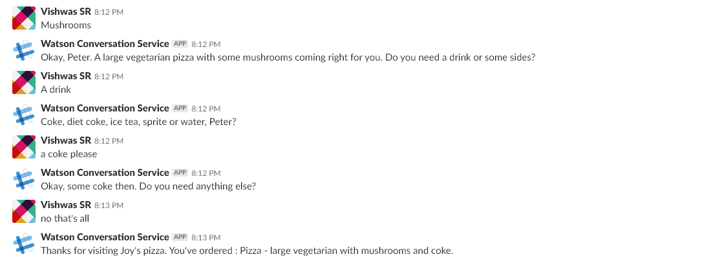

# IBM-Watson-Conversation-Slots-Joys-Pizza
A sample pizza ordering chatbot using the IBM Watson Assistant Slots feature. Includes a sample node js conversation service app for the same. Deployed on slack and facebook messenger. https://joyspizza.mybluemix.net/

This is to illustrate the use of IBM Watson's conversation service (Watson Assistant) to build a sample chatbot. This is extended from the  given by IBM.

To setup, please use the below resources:
1. 
2. 
3. 

To deploy on stack and messenger you can either follow the instructions on bluemix or 

## Highlights
* Create a chatbot dialog with Watson Assistant
* Use the power of Assistant Slots to more efficiently populate data fields
* Use Assistant Slots to handle various inputs within one Node.

## Flow
1. User sends messages to the application (running locally or on IBM Cloud).
2. The application sends the user message to IBM Watson Assistant service, and displays the ongoing chat in a web page.
3. Watson Assistant uses the Slots feature to fill out the required fields for a pizza order, and sends requests for additional information back to the running application.

# Details
Contains:

Intents:

Entities:

Dialog:

Slots:

Config slot:

Slack sample: 

More on slots 
